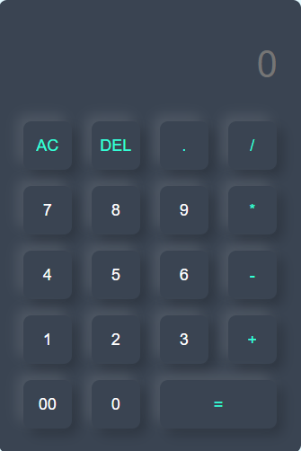

# 🧮 Calculator

  

A visually appealing and fully functional calculator designed with a modern touch using **HTML**, **CSS**, and **JavaScript**. Perfect for performing basic arithmetic while showcasing clean UI and smooth interactivity.

---

## 🌟 Features

- **Elegant Design**: Minimalistic and modern UI with soft shadows and intuitive layout.
- **Core Functionality**: Supports addition, subtraction, multiplication, division, and decimal operations.
- **Responsive Interface**: Works seamlessly across devices and screen sizes.
- **Clear Controls**: Includes "AC" for reset and "DEL" for step-by-step correction.

---

## 🔧 Technologies Used

- **HTML**: Structure and semantic layout.
- **CSS**: Custom styling with modern aesthetics.
- **JavaScript**: Core functionality and logic.

---

## 🎮 How to Use

1. Clone this repository or download the project files.
2. Open `index.html` in your favorite web browser.
3. Use the on-screen buttons to perform calculations:
   - Tap **AC** to reset all input.
   - Use **DEL** to delete the last entry.
   - Perform calculations and press **=** for results.

---

## 🚀 Project Highlights

- Clean and minimal interface with glowing button effects.
- Easy-to-read display for quick calculations.
- Built for practice and learning JavaScript DOM manipulation.

---

## 💡 Inspiration

This project was built as a step toward mastering front-end development and combining design with functionality. It’s a great example of how small projects can have a polished and professional feel.

---

Feel free to clone, use, or contribute to the project! Feedback is always welcome. 😊
